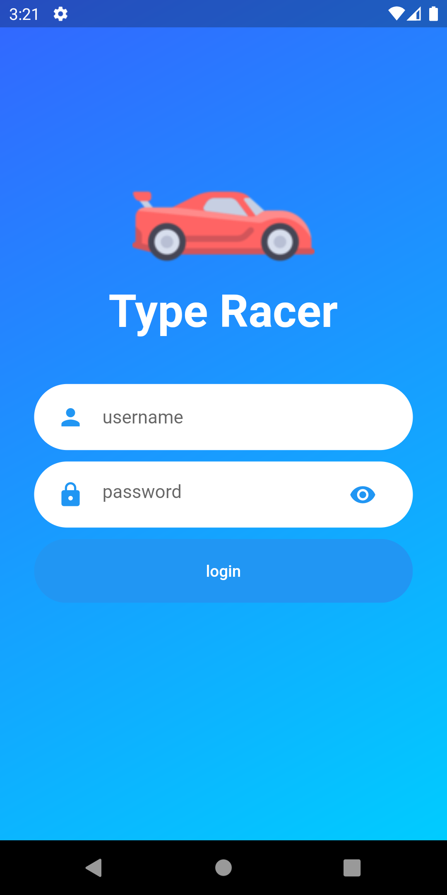
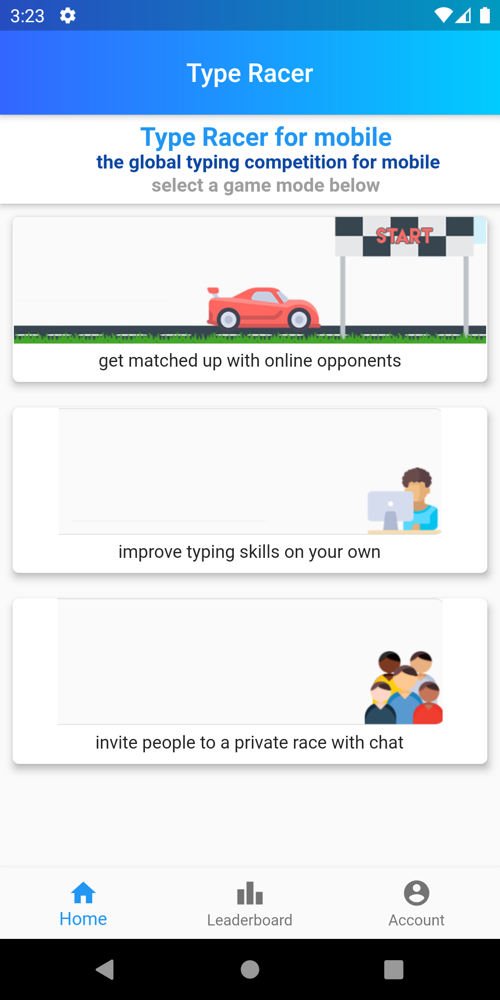
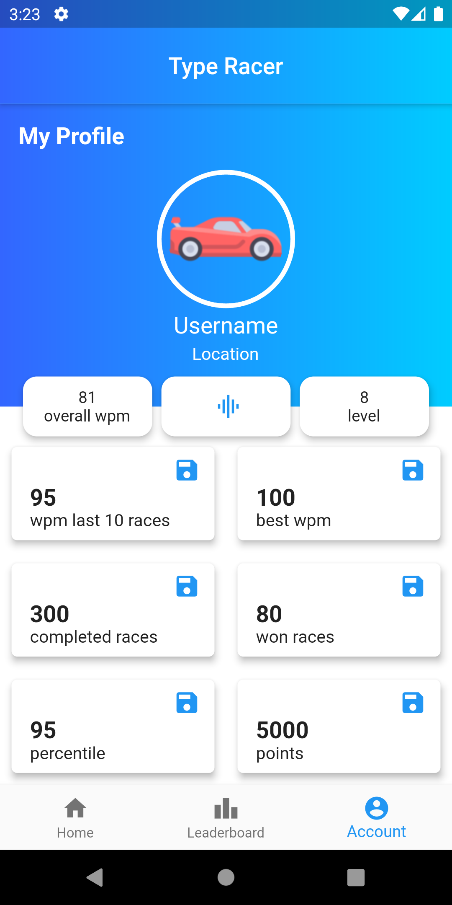
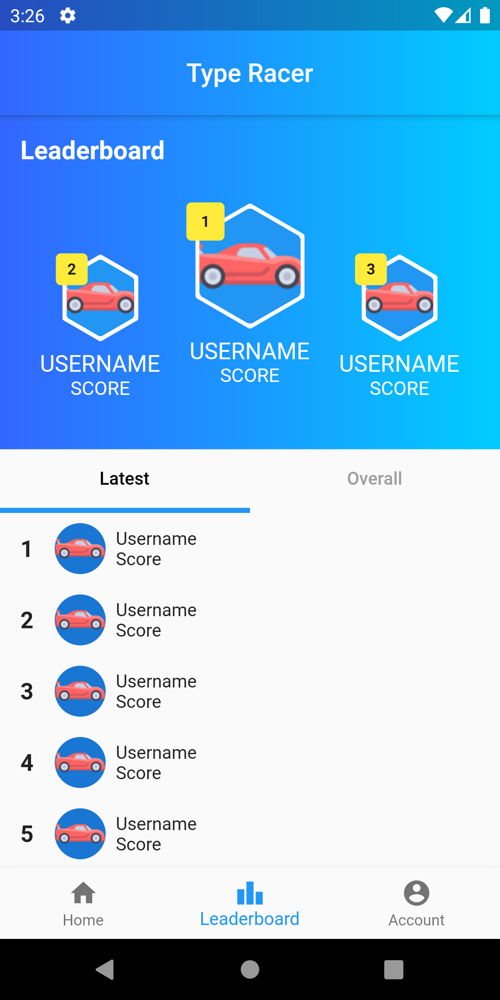
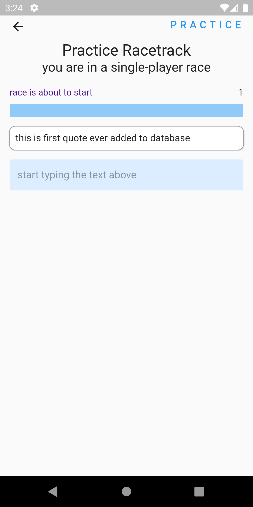
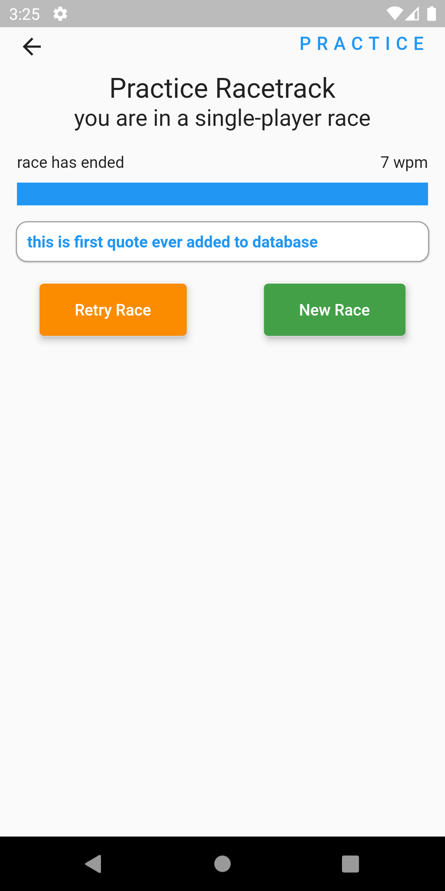

# Type Racer

this is my first flutter project based on the webgame https://play.typeracer.com/. I wanted to create a similar style type racing app where you could race random competitors, practice type races on your own, and invite friends to play.

go to [typeracer/readme](..\typeracerfrontend\README.md) to see development history

what the interface looks like so far

| Login                                   |                    Home                    |                                     Account |
| :-------------------------------------- | :----------------------------------------: | ------------------------------------------: |
|  |  |  |

| Leaderboard                                         |                    Practice Start                     |                                            Practice Over |
| :-------------------------------------------------- | :---------------------------------------------------: | -------------------------------------------------------: |
|  |  |  |

